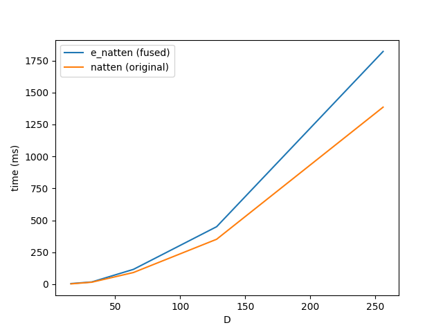

# Efficient Neighborhood Attention

Neighborhood attention ([Hassani et al., 2022](https://arxiv.org/pdf/2204.07143.pdf)) is a
sliding window attention mechanism that achieves O(N) time and space complexity by localizing
self-attention to nearest neighboring pixels. This is a reasonable approximation, especially
for the lower layers of a vision model, where the receptive field is small. It is similar to
Stand-Alone Self-Attention ([Ramachandran et al., 2019](https://arxiv.org/pdf/1906.05909.pdf))
except for how edges are treated.

While it does achieve linear time complexity in theory, the [official repository](https://github.com/SHI-Labs/NATTEN)
provides a tiled implementation that materializes the attention matrix, causing unnecessary
data transfer between HBM and SRAM in the GPU. This repository provides a fused implementation
similar to Flash Attention, where we avoid materializing the attention matrix to save time and
memory.

### Benchmarks

Forward and backward pass comparison of the fused and original natten implementation. Run with
batch size 4, 4 heads, head dimension 128, and kernel size 5. The parameter on the x-axis is the
image size in 2D, so the number of tokens is the square of this value. All experiments run on
an A100 GPU.

| Forward Pass | Backward Pass |
|---------------------|------------------------|
|  |  |
